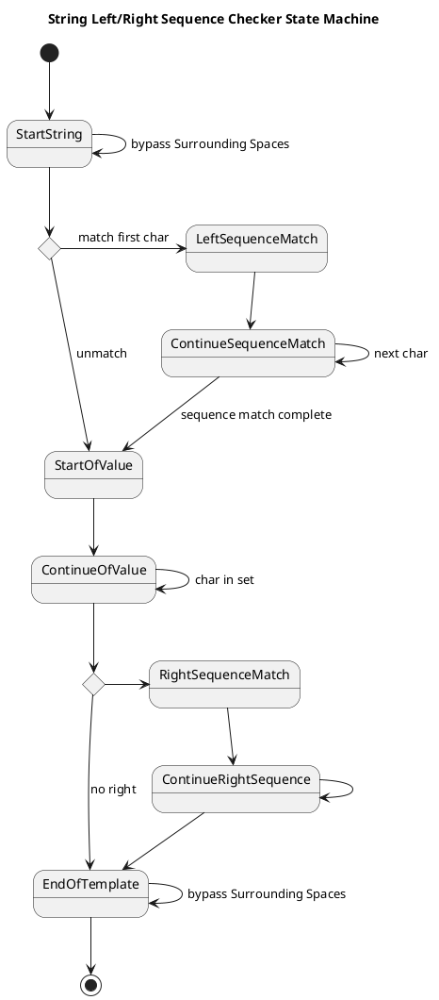

The String Left/Right Sequence Checker
=============

The Left/Right Sequence checker is a state machine that processes a string to check for specific left and right sequences. The state machine starts by checking the left sequence, then continues to the right sequence if the left sequence matches. If the right sequence does not match, it ends the process.

The state machine is designed to handle surrounding spaces and allows for a sequence of characters to be matched in the string. The diagram below illustrates the flow of the state machine.

